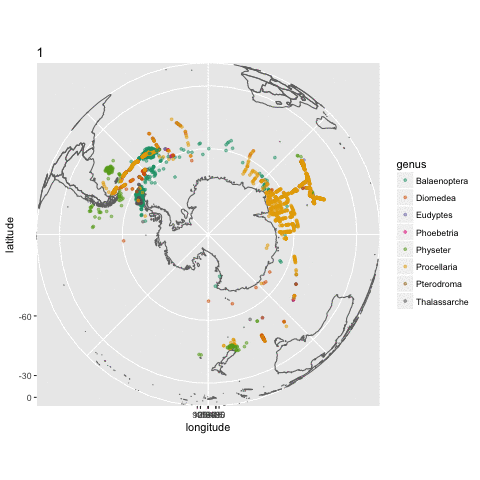

# super-doodle

## Visualizing time dimension with animation

This is a demo to produce a time lapse of threatened antarctic/subantarctic species using occurrence data from [OBIS](iobis.org) retrieved using their R package [robis](https://github.com/iobis/robis), [IUCN redlist](http://www.iucnredlist.org/) classification and [gganimate](https://github.com/dgrtwo/gganimate) library.

Shown below is the `.gif` produced from the R notebook [here](./occurrence-time-lapse/occurrence_time_lapse.Rmd).

## Visualizing taxa with sunburst

A demo to visualise taxa using interactive sunburst. Checkout the awesome library [sunburstR](https://github.com/timelyportfolio/sunburstR)

 dataset.](taxa-sunburst/taxa-sunburst.png)