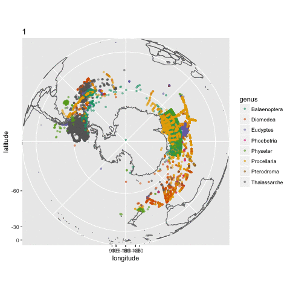

## Objective
To create a mockup for timelapse gif of threatened antarctic/subantarctic species.

## Load libraries 
[ImageMagick](https://github.com/ImageMagick/ImageMagick) is required in order to use [gganimate](https://github.com/dgrtwo/gganimate) convert.

```{r message=FALSE, warning=FALSE}
source("./variables.R")
library(jsonlite)
library(maps)
library(mapproj)
library(robis)
library(dplyr)
library(ggplot2)
library(RColorBrewer)
library(gganimate)  # require ImageMagick
```

## Request using IUCN redlist API
<span style="color:red">Note: You will need to request for a token from IUCN redlist to do this.</span>

Request for all IUCN redlist species with country code = AQ (antarctica)

```{r}
request <- paste("http://apiv3.iucnredlist.org/api/v3/country/getspecies/AQ?token=", token, sep = "")
rl <- fromJSON(request)
rl <- rl$result
head(rl)
```

Subset data frame to entries with vulnerable, critical and endangered species only.

```{r}
# filter for results that are threatened (vulnerable, critical and endangered)
not.lc.dd <- rl %>% filter(category %in% c("CR", "EN", "VU"))
unique(not.lc.dd$category)
```

## Request for occurrences using [robis](https://github.com/iobis/robis)
Request for all occurrence records of these threatened species within antarctic and subantarctic zone from OBIS.

```{r message=FALSE, warning=FALSE, results="hide"}
# get the occurrence of these threatened species from OBIS using API
# polygon include antarctic and subantarctic area
occ <- occurrence(scientificname = not.lc.dd$scientific_name, geometry = "POLYGON((180 -90, -180 -90, -180 -45, 180 -45, 180 -90))")

# remove preservedSpecimen occurrences
obs <- occ %>% filter(basisOfRecord != "PreservedSpecimen")

# convert eventDate from string to date time format
occ$eventDate <- strptime(occ$eventDate, format = "%Y-%m-%d %H:%M:%S", tz = "GMT")
occ$month <- as.numeric(format(occ$eventDate, "%m"))
```

## Plot orthographic projected map and animate with [gganimate](https://github.com/dgrtwo/gganimate)
Plot map with orthographic projection from South Pole and add a layer of occurrences, color by genus.

Animate the plots and create a gif file called `occ_by_month.gif`

```{r message=FALSE, warning=FALSE}
# plot map with orthographic projection from South Pole
world <- map_data("world")
head(world)

p <- ggplot() + 
  geom_path(data = world, aes(x = long, y = lat, group = group), colour = "#707070") +
  scale_y_continuous(name = "latitude", breaks = (-2:2) * 30) + 
  scale_x_continuous(name = "longitude", breaks = (-4:4) * 45) + 
  coord_map("ortho", orientation = c(-90, 0, 0)) +
  geom_point(data = occ, aes(x = decimalLongitude, y = decimalLatitude, color = genus, frame = month), size = 1, alpha = 0.5) +
  scale_color_brewer(palette = "Dark2")
  
# animate it
animation <- gganimate(p, interval=.5, "occ_by_month.gif")
```



## Remarks
It's a nice exercise to show what you can do for occurrence records with R using information from [OBIS](http://iobis.org/) and [IUCN redlist](http://www.iucnredlist.org/). 

Please note that this exercise is not based on science. For instance, there are a lot more occurrence records from November to March, because there are more people at field work in Antarctica at that period. I am assuming that all occurrences here means presence. Not observing an occurrence do not means its absence either.
